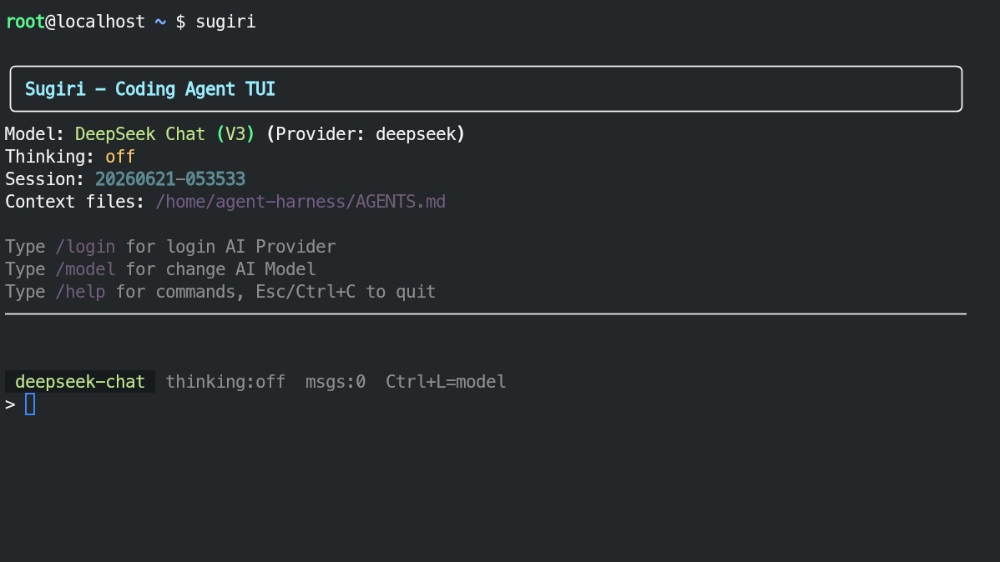

# Sugiri — AI Coding Agent

> **"The AI agent that remembers. Built in Indonesia, works everywhere."**
>
> Created by **Ilham Sugiri** | [MIT License](LICENSE) | 🤖 DeepSeek · Claude · GPT · Gemini

Sugiri is an AI coding agent that runs in your terminal. It gives AI models four powerful tools — `read`, `write`, `edit`, and `bash` — to help you code. Supports **Linux**, **Windows**, **macOS**, and **Android** (Alpine Linux on Acode editor). Currently supports **DeepSeek**, **Claude**, **GPT**, and **Gemini** APIs — more coming soon.

Sugiri comes with a **`/remember`** feature — when enabled, it automatically summarizes your conversation at the end of each session and saves it to `.agent/memory.md`. The next time you open a session, the AI picks up right where you left off, remembering what you worked on, what decisions were made, and what problems were being solved — no need to re-explain everything.

Every API call has a cost — Sugiri tells you exactly how much. With **`/cost`** and a live cost counter in the status bar, you always know what you're spending down to the cent. No surprises, no runaway bills. Use `/cost` anytime to see your token usage and total session spend.

> 🐍 Pure Python · 📦 One-click install · 🤖 4 AI providers · 🧠 Thinking mode · 💰 Cost tracking · 🔌 Extensible · 📜 MIT  
> **v1.2.3** — 17 bug fixes: spinner, input wrap, cost tracking, session reset, Google tool result, remember persist + more

[]()
[]()
[](LICENSE)

## 🔗 Links

- [Website](#) *(coming soon)*
- [Documentation](#) *(coming soon)*


## 🖼️ Screenshot



## 📥 Download

| OS | Installer | Need |
|----|-----------|------|
| 🐧 Linux | [install-sgr-1.2.3.sh](https://github.com/ilhampiranha08-tech/sugiri-agent-harness-p/releases/download/ai_code_agent/install-sgr-1.2.3.sh) | Internet |
| 🪟 Windows | [install-sgr-1.2.3.bat](https://github.com/ilhampiranha08-tech/sugiri-agent-harness-p/releases/download/ai_code_agent/install-sgr-1.2.3.bat) | Internet |
| 🪟 Windows, 🐧 Linux & 🍎 macOS | [install-sgr-1.2.3.py](https://github.com/ilhampiranha08-tech/sugiri-agent-harness-p/releases/download/ai_code_agent/install-sgr-1.2.3.py) | Python + Internet |

---

## Quick Start

### Option 1: One-Line Installer (Recommended)

Just copy-paste one line into your terminal:

**🐧 Linux:**
```bash
curl -fsSL https://github.com/ilhampiranha08-tech/sugiri-agent-harness-p/releases/download/ai_code_agent/install-sgr-1.2.3.sh | bash
```

**🪟 Windows (PowerShell):**
```powershell
irm https://github.com/ilhampiranha08-tech/sugiri-agent-harness-p/releases/download/ai_code_agent/install-sgr-1.2.3.bat -OutFile $env:TEMP\sgr.bat; & $env:TEMP\sgr.bat
```

**🪟 Windows (CMD):**
```cmd
curl -fsSL https://github.com/ilhampiranha08-tech/sugiri-agent-harness-p/releases/download/ai_code_agent/install-sgr-1.2.3.bat -o %TEMP%\sgr.bat && %TEMP%\sgr.bat
```

**🐍 Cross-platform 🐧 Linux / 🍎 macOS / 🪟 Windows (need Python 3.10+):**
```bash
curl -fsSL https://github.com/ilhampiranha08-tech/sugiri-agent-harness-p/releases/download/ai_code_agent/install-sgr-1.2.3.py | python3
```

The installer auto-detects your OS, installs Python if missing, and sets up Sugiri.
Then just open a terminal and type `sugiri`.

### Option 2: One-Click Installer

*Download the installer for your OS from the [table above](#-download), then:*

**🐧 Linux:**
1. Download [install-sgr-1.2.3.sh](https://github.com/ilhampiranha08-tech/sugiri-agent-harness-p/releases/download/ai_code_agent/install-sgr-1.2.3.sh)
2. Open a terminal in your downloads folder:
   ```bash
   cd ~/Downloads
   ```
3. Run the installer:
   ```bash
   chmod +x install-sgr-1.2.3.sh
   ./install-sgr-1.2.3.sh
   ```

**🪟 Windows:**
1. Download [install-sgr-1.2.3.bat](https://github.com/ilhampiranha08-tech/sugiri-agent-harness-p/releases/download/ai_code_agent/install-sgr-1.2.3.bat)
2. Double-click the file

**🐍 Cross-platform (Python):**
1. Download [install-sgr-1.2.3.py](https://github.com/ilhampiranha08-tech/sugiri-agent-harness-p/releases/download/ai_code_agent/install-sgr-1.2.3.py)
2. Open a terminal in your downloads folder:
   ```bash
   cd ~/Downloads
   ```
3. Run the installer:
   ```bash
   python3 install-sgr-1.2.3.py
   ```

### Option 3: Manual (pip)

```bash
# 1. Download the project
git clone https://github.com/USERNAME/sugiri.git
# Or extract the tar.gz:
# tar xzf sugiri-project.tar.gz

# 2. Enter the project folder
cd sugiri-agent-harness

# Install Sugiri (dependencies auto-installed)
pip install -e .

# Set API key via environment:
export DEEPSEEK_API_KEY="sk-xxxxx"
# Or use the /login command inside Sugiri

# Run
sugiri
```

### Uninstall

Sugiri only stores files in two user folders — no registry, no system service, no leftovers.

| OS | Command |
|----|---------|
| 🐧 **Linux** | `pip uninstall sugiri -y`<br>`rm -rf ~/.sugiri ~/.agent` |
| 🍎 **macOS** | `pip uninstall sugiri -y`<br>`rm -rf ~/.sugiri ~/.agent` |
| 🪟 **Windows** | `pip uninstall sugiri -y`<br>`rmdir /s /q %USERPROFILE%\.sugiri`<br>`rmdir /s /q %USERPROFILE%\.agent` |

> ⚠️ The `~/.agent` folder contains your API keys (`auth.json`) and session history. Only delete if no longer needed.

## Why Sugiri?

| | |
|---|---|
| 🇮🇩 **Made in Indonesia** | Created by Ilham Sugiri |
| 🐍 **Pure Python** | No Node.js, no npm — just Python |
| 📦 **One-click install** | `install.sh` or `install.bat`, done |
| 🤖 **4 AI providers** | DeepSeek, Claude, GPT, Gemini |
| 🧠 **Thinking mode** | Extended reasoning on all models |
| 🔌 **Extensible** | Custom tools & skills via Python |
| 🖥️ **Rich TUI** | File picker, model selector, clean UI |
| 🌍 **Cross-platform** | Linux, Windows, macOS, Android |
| 🧠 **Session memory** | `/remember` — auto-summarizes and recalls across sessions |
| 📜 **MIT License** | Free to use, modify, and share |

## Supported Linux Distros

| Package Manager | Distros |
|:---------------:|---------|
| **apt** | Debian, Ubuntu, Linux Mint, Pop!_OS, Kali, Elementary |
| **pacman** | Arch Linux, Manjaro, EndeavourOS, Garuda |
| **dnf** | Fedora, RHEL 8+, CentOS 8+, Rocky Linux, AlmaLinux |
| **yum** | RHEL 7, CentOS 7 |
| **zypper** | openSUSE, SUSE Linux Enterprise |
| **apk** | Alpine Linux (Acode editor) |
| **xbps** | Void Linux |

> Other distros: install Python 3.10+ manually, then run `install.py` or `pip install -e .`

## Architecture

```
┌─────────────────────────────────────────────┐
│                  CLI (cli.py)                │
├─────────────────────────────────────────────┤
│  Modes: interactive │ print │ json │ rpc    │
├─────────────────────────────────────────────┤
│           AgentSession (session.py)         │
├────────────────────┬────────────────────────┤
│   Agent (agent.py) │ SessionManager (jsonl) │
├────────────────────┼────────────────────────┤
│  Providers         │ Extensions             │
│  (DeepSeek, Claude,│ (Custom tools,         │
│   GPT, Gemini)     │  events, commands)     │
├────────────────────┼────────────────────────┤
│  Tools             │ Resources              │
│  (read, write,     │ (skills, prompts,      │
│   edit, bash)      │  themes, AGENTS.md)    │
└────────────────────┴────────────────────────┘
```

## Features

### 🛠️ Built-in Tools
- **read** - Read file contents with offset/limit, supports images
- **write** - Create or overwrite files, auto-creates directories
- **edit** - Precise text replacements with diff output
- **bash** - Execute shell commands with timeout support

### 🤖 Multiple LLM Providers
- **DeepSeek** Chat (V3) & Reasoner (R1) with thinking support
- **Anthropic** Claude (Sonnet, Opus, Haiku) with extended thinking
- **OpenAI** GPT-4o & o4-mini with function calling & reasoning
- **Google** Gemini 2.5 Pro & Flash with native tool support
- Extensible: add custom providers

### 📝 Session Management
- JSONL tree-structured session files
- In-place branching (navigate any point in conversation)
- Fork sessions from any entry point
- Continue recent sessions
- LLM-powered compaction for long conversations

### 🔌 Extensions
Python modules that extend functionality:
- Register custom tools callable by the LLM
- Subscribe to lifecycle events
- Add slash commands
- Create interactive UI components

```python
# examples/extensions/custom_tool.py
def default(api: ExtensionAPI):
    api.register_tool(WeatherTool())
```

### 📚 Skills
Markdown-based skill packages:
- Self-contained capability packs
- Loaded on-demand by the agent
- Include instructions, scripts, and reference docs

### 📋 Prompt Templates
Reusable prompts as Markdown files:
- Type `/review` to expand a code review template
- Supports `{{placeholder}}` substitution
- Store in `~/.agent/prompts/` or `.agent/prompts/`

### 🎨 Themes
JSON-based theme files with color definitions and style mappings.

### 📦 Package Management
- Install extensions/skills/themes as packages
- Support for local, git, and npm sources
- Project-local and global installations

## Usage

### Interactive Mode
```bash
sugiri                          # Interactive chat
sugiri -v                       # Show version
sugiri list                     # List installed packages
```

### Keyboard Shortcuts
| Key | Action |
|-----|--------|
| **Ctrl+L** | Open model selector |
| **Ctrl+C** | Clear input / double to quit |
| **Esc** | Cancel input / abort agent / quit |
| **Enter** | Send message |
| **@** | File picker |
| `\` at end of line | Multiline (Shift+Enter) |

### Commands
| Command | Description |
|---------|-------------|
| `/login` | Set API key for a provider |
| `/model` | Interactive model selector |
| `/thinking` | Interactive thinking level selector |
| `/permission` | Toggle permission gate on/off |
| `/remember` | Toggle session memory on/off |
| `/session` | Show session info |
| `/compact` | Compact conversation |
| `/clear` | Clear conversation history |
| `/new [name]` | Start new session |
| `/export [path]` | Export session to Markdown |
| `/cost` | Show token usage and session cost |
| `/sessions [keyword]` | List or search past sessions |
| `/help` | Show all commands |
| `/quit` or `/exit` | Exit |

### Non-Interactive Modes
```bash
# Print mode
echo "Summarize this" | sugiri -p
sugiri -m "Hello" -p

# JSON mode
sugiri --mode json -m "List files"

# RPC mode
sugiri --mode rpc
```

### Model Selection
```bash
sugiri --provider deepseek --model deepseek-chat
sugiri --model openai/gpt-4o
sugiri --thinking high
```

### Extensions
```bash
sugiri -e examples/extensions/hello.py
sugiri -e examples/extensions/permission_gate.py
```

### Tools Control
```bash
sugiri -t read --mode print "Review code"
sugiri -t read,bash,edit
```

### Sessions
```bash
sugiri --session /path/to/session.jsonl
sugiri --fork /path/to/session.jsonl
sugiri --name "my task"
sugiri --no-session
```

## Configuration

Settings stored in:
- `~/.agent/settings.json` (global)
- `.agent/settings.json` (project-local)

```json
{
  "default_provider": "deepseek",
  "default_model": "deepseek-chat",
  "default_thinking": "off",
  "theme": "dark",
  "compaction_enabled": true,
  "retry_enabled": true,
  "max_retries": 3
}
```

## Project Structure

```
├── cli.py                    # CLI entry point
├── src/
│   ├── core/                 # Types, agent loop, session
│   ├── providers/            # DeepSeek, Claude, GPT, Gemini
│   ├── tools/                # read, write, edit, bash
│   ├── sessions/             # JSONL storage
│   ├── extensions/           # Plugin system
│   ├── packages/             # Package manager
│   ├── config/               # Settings
│   ├── ui/                   # Terminal UI + selectors
│   └── modes/                # interactive, print, json, rpc
├── install/                  # One-click installers
├── examples/                 # Extensions, skills, prompts, themes
├── docs/                     # Screenshots
└── tests/                    # Test suite
```

## Philosophy

1. **Minimal core** - Only essential features built in
2. **Extensible** - Customize via extensions, skills, themes
3. **Adaptable** - Shape it to your workflow
4. **Transparent** - Sessions are plain JSONL files

No MCP, no sub-agents, no permission popups, no plan mode. Build what you need.

## License

MIT — See [LICENSE](LICENSE)
